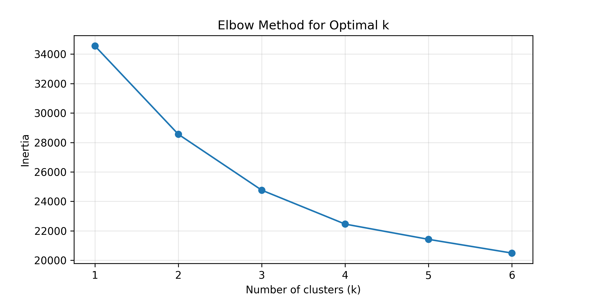
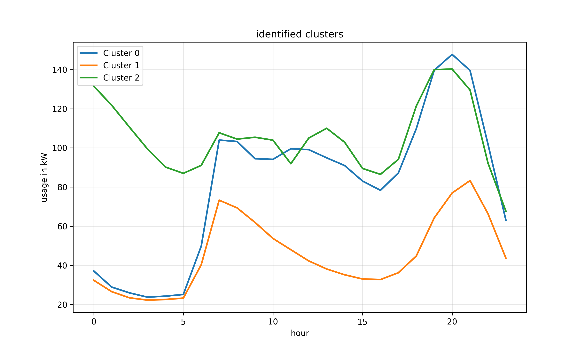

# Smart Home Energy Analysis

This project analyzes household electricity consumption using machine learning and data visualization techniques. The goal is to identify usage patterns, detect anomalies, and group consumption behaviors.

## Project Overview
The analysis pipeline includes:
1. **Data Preprocessing:** Cleaning the dataset and handling missing values.
2. **Outlier Detection:** Identifying unusual energy spikes that deviate from normal behavior.
3. **Clustering:** Grouping similar consumption days using K-Means (e.g., high-usage vs. eco-days).
4. **Pattern Visualization:** Creating insightful charts to interpret daily routines.

## Results & Visualizations
Below are the key findings from the automated analysis:

### 1. Outlier Detection
This chart highlights specific points in time where energy consumption was significantly higher than average.

### 2. Determining Optimal Clusters (Elbow Method)
To find the ideal number of consumer groups, I used the Elbow Method. The "bend" in the curve (the elbow) indicates the optimal balance between cluster granularity and model simplicity. In this case, $k=3$ or $k=4$ was chosen. 

### 3. Consumption Clusters
Using K-Means clustering, I identified distinct energy usage profiles, showing the difference between baseline consumption and peak activity.

### 4. Daily Routines
A visualization of energy consumption across different household zones (Kitchen, Laundry, Water-Heater & Air-Conditioner) based on the time of day.

## Tech Stack
* **Language:** Python
* **Libraries:** Pandas, Scikit-Learn, Matplotlib
* **Dataset:** UCI Machine Learning Repository (Individual household electric power consumption)
